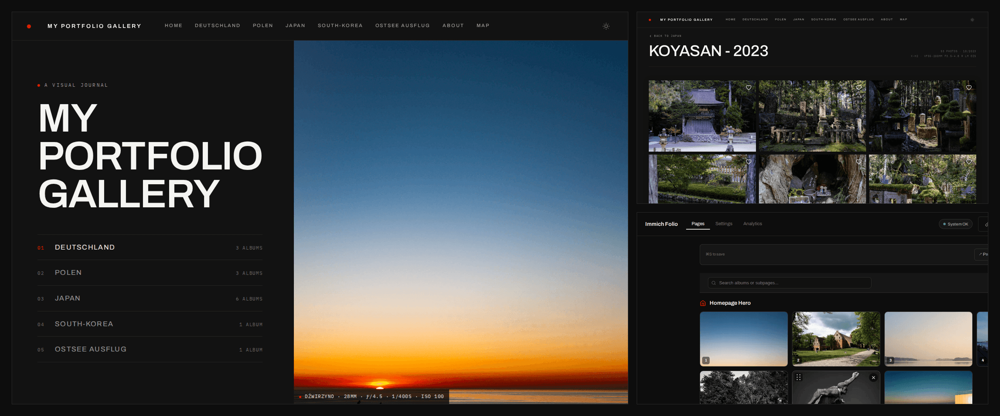
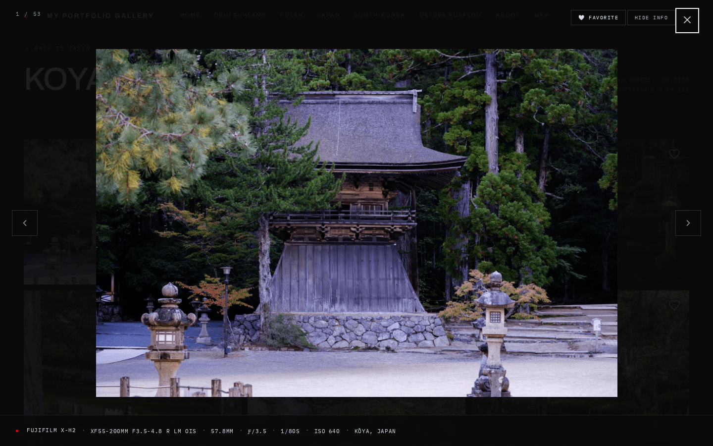
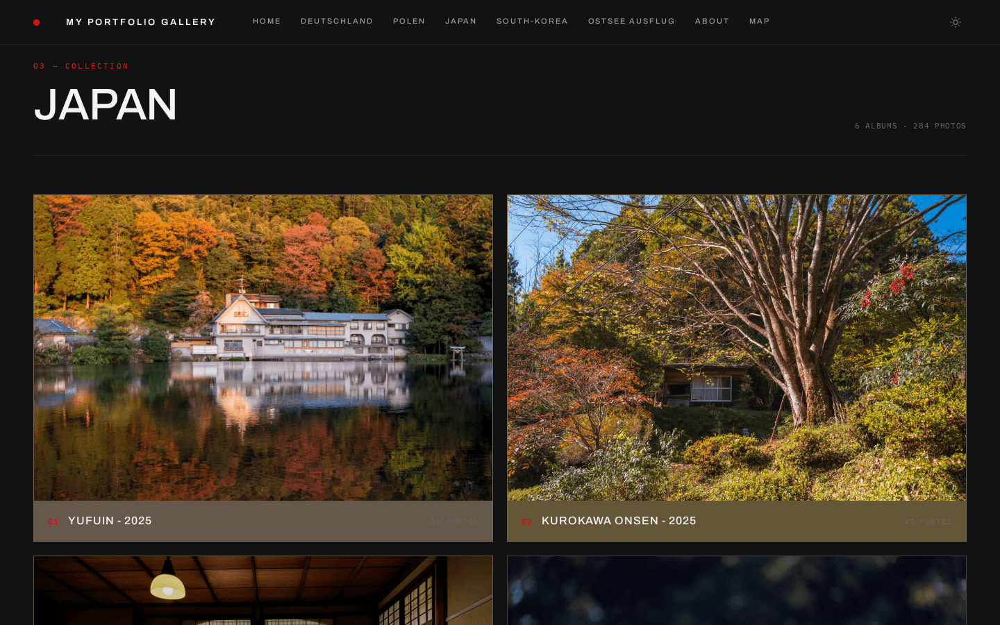
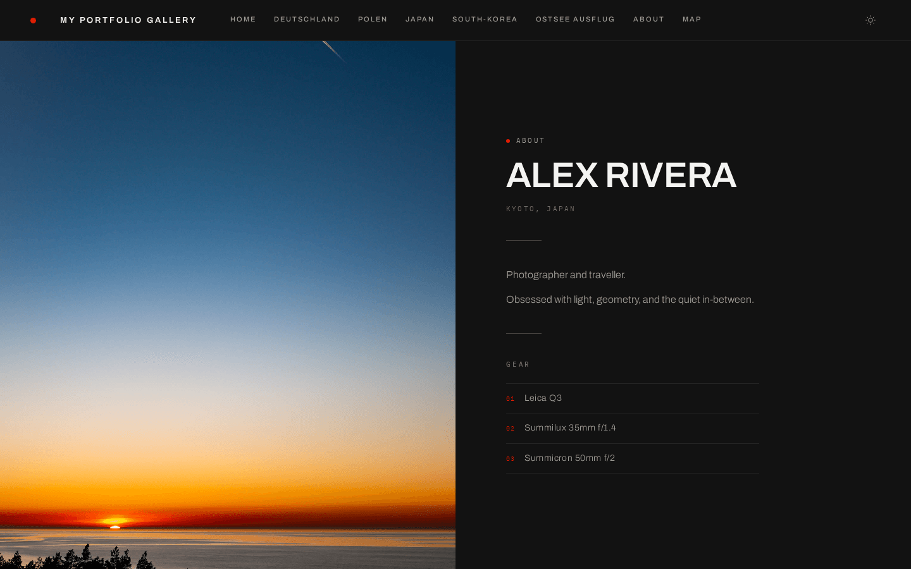
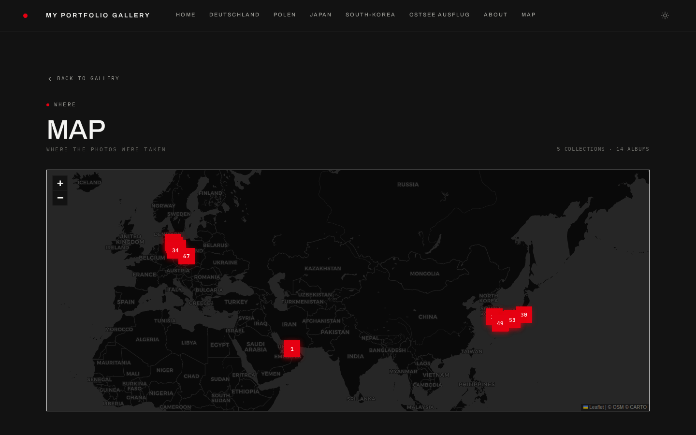
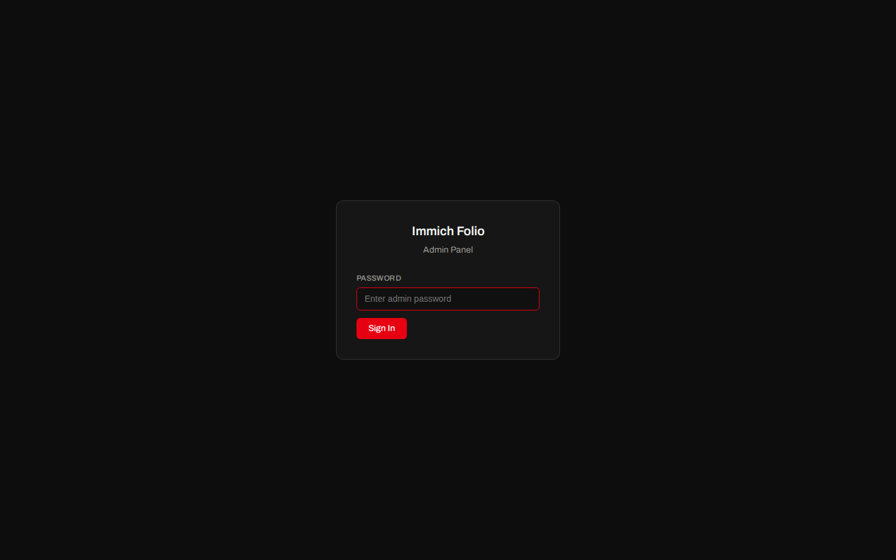
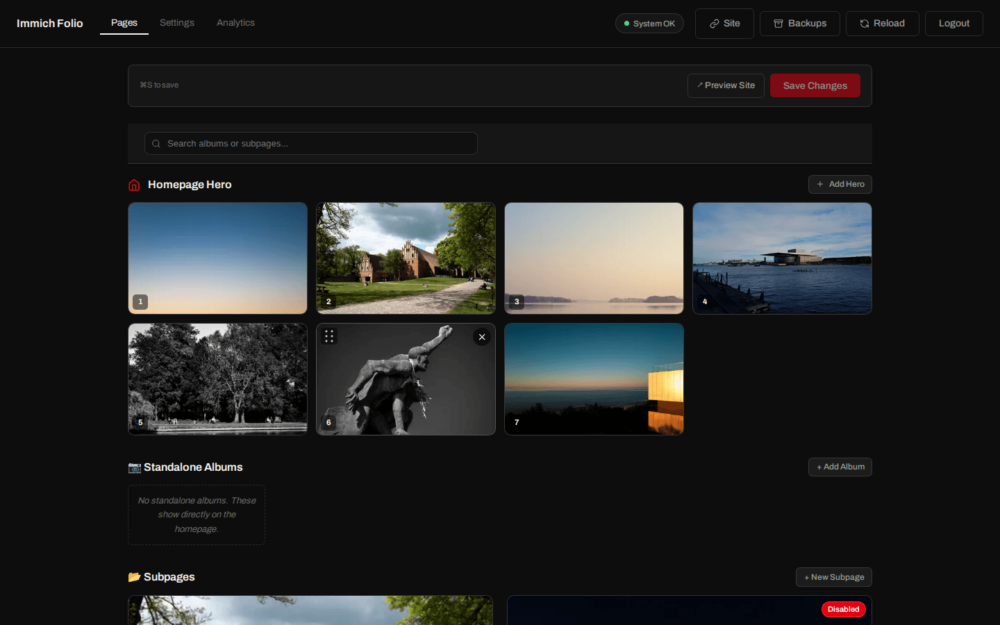
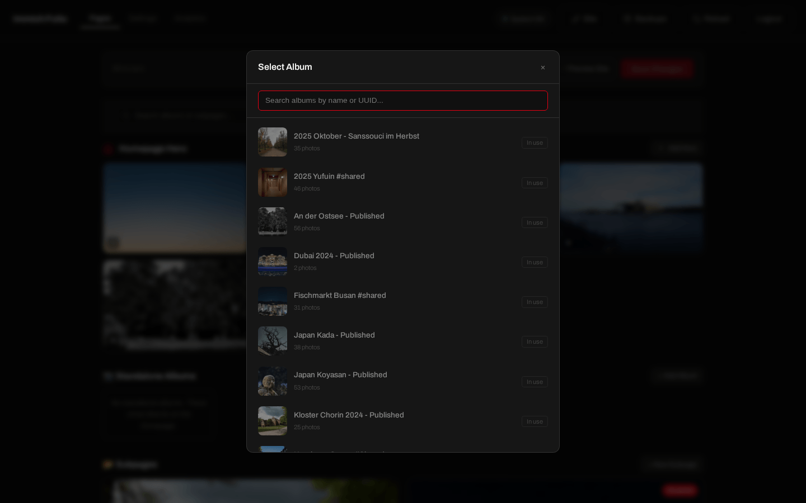
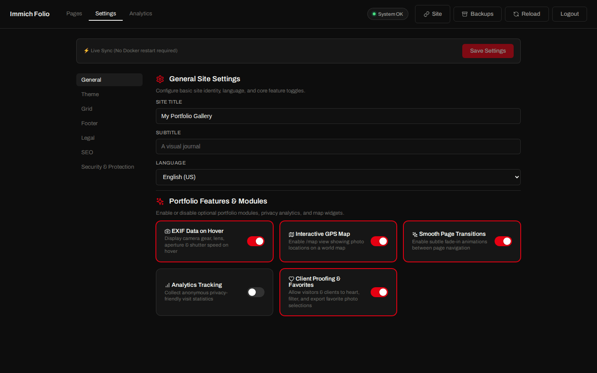

# Immich Folio

**Turn your Immich albums into a public photography portfolio — without ever exposing your Immich server to the internet.**

<p>
  <a href="LICENSE"></a>
  <a href="https://github.com/ralksta/immich-folio/releases"></a>
</p>

<p align="center">
  
</p>

A self-hosted portfolio powered by [Immich](https://immich.app). It acts as a **secure reverse proxy** between your visitors and your private Immich instance: your Immich server stays on your local network, completely invisible to the outside world, while your albums are published as a gallery you control.

## Contents

- [Features](#features)
- [Requirements](#requirements)
- [Quick Start](#quick-start)
- [First-Run Setup](#first-run-setup)
- [Configuration](#configuration)
- [Docker](#docker)
- [Admin Panel](#admin-panel)
- [What's New](#whats-new)

**Guides:** [Gallery Configuration](docs/gallery-config.md) · [Theming](docs/theming.md) · [Journal & Photo Essays](docs/journal.md) · [Admin Panel](docs/admin-panel.md) · [Deployment](docs/deployment.md)

## Features

### Gallery & Layout

- **Configurable hero layouts** — split, fullbleed, minimal, stacked (image + thumbnail strip), typographic (text-only), or mosaic (multi-image grid)
- **Hero image carousel** — single image or crossfade carousel of multiple Immich assets
- **Masonry photo grid** — responsive layout with natural aspect ratios and configurable columns, gap, and aspect ratio
- **Uniform grid mode** — switch to a fixed-aspect uniform grid per-subpage or globally
- **Showcase / filmstrip / editorial-flow layouts** — featured hero + grid, horizontal scroll strips, or alternating full-width and paired images
- **Justified rows** _(experimental)_ — every row fills the width at one shared height, aspect ratios intact, nothing cropped
- **Per-subpage grid overrides** — each subpage can define its own columns, gap, aspect ratio, and layout mode, and individual albums can override that again _(experimental)_
- **Cover focal points** _(experimental)_ — decide which part of a cover survives the crop
- **Fullscreen lightbox** — keyboard and swipe navigation, EXIF panel, adjacent image preloading
- **EXIF metadata on hover** — camera body, lens, focal length, aperture, shutter speed, ISO shown directly on the grid
- **ThumbHash placeholders** — instant blurred previews while full images load

<p align="center">
  
  
</p>
<p align="center"><em>Masonry and showcase, both in Studio Modern — the same album, a different grid layout.</em></p>

<p align="center">
  
</p>
<p align="center"><em>The fullscreen lightbox with the EXIF panel — camera, lens and exposure for the frame on screen.</em></p>

### Content & Organization

- **Subpage grouping** — organize albums into named collections (e.g. `/japan/tokyo-2023`)
- **Auto-generated slugs** — URL slugs derived from album names automatically
- **YAML gallery config** — all gallery structure defined in a single `content/gallery.yaml` file
- **Markdown about page** — `content/about.md` with frontmatter for portrait, name, location, and gear list, editable from the admin panel
- **Journal** — photo essays and travel stories at `/journal`, with drafts, per-entry passwords, cover images and reading times
- **Photo Essay mode** — long-form storytelling pages alternating text with fullbleed and paired image layouts
- **Unlisted subpages** _(experimental)_ — reachable by direct link, absent from the navigation
- **Subpage on/off toggle** — take a page offline without deleting it
- **External navigation links** _(experimental)_ — point the header at a shop, a blog, or a social profile
- **Client proofing** — clients favorite photos and export the selection; picks are encoded in the URL, nothing is stored server-side
- **Lightbox watermark** — configurable overlay on fullscreen images
- **Privacy-friendly analytics** — cookieless view counts, no third parties, can be switched off
- **Dynamic OG images** — auto-generated social preview images per album

<p align="center">
  
</p>
<p align="center"><em>A subpage grouping several albums into one collection.</em></p>

<p align="center">
  
  
</p>
<p align="center"><em>The Markdown about page and the GPS map, both generated from your Immich data.</em></p>

### Admin Panel

- **Visual page builder** — drag & drop interface to manage hero images, standalone albums, subpages, and sections
- **Album picker** — browse all shared Immich albums with search, see photo counts, and add them with one click
- **Settings editor** — configure theme, grid layout, footer, legal/impressum, SEO, image protection and the about page from a visual UI
- **Visual previews everywhere** — grid layout, theme, photo frame, hero style and the Google search snippet are picked from preview cards instead of text fields
- **Journal Studio** — split-screen block editor with a live preview of the real page
- **Essay block editor** — assemble photo essays block by block without touching Markdown
- **Photo order editor** — drag & drop a hand-picked opening sequence for any album
- **Favicon upload** — give the site its own icon in the browser tab
- **Backup manager** — every save is backed up automatically; restore any of them with one click
- **Live YAML sync** — changes are written directly to `gallery.yaml` and `settings.yaml` with automatic backups
- **Password protected** — secured with its own admin password, separate from album passwords

<details>
<summary><strong>Security &amp; Infrastructure</strong></summary>

<br>

| Concern                    | Protection                                                                           |
| -------------------------- | ------------------------------------------------------------------------------------ |
| **Server exposure**        | Immich URL never leaves your network — all requests proxy server-side                |
| **API key**                | Stored only in `.env.local`, never in client code                                    |
| **Asset IDs**              | Immich UUIDs encrypted (AES-256) into opaque tokens                                  |
| **Album scope**            | Only albums in `gallery.yaml` are accessible                                         |
| **Password protection**    | Per-subpage password support                                                         |
| **Rate limiting**          | Per-IP sliding-window rate limiter (configurable RPM)                                |
| **Vulnerability scanning** | Docker image scanned with Trivy on every release, results in the GitHub Security tab |

- Health check endpoint at `GET /api/health`
- In-memory caching with configurable TTL
- Standalone Docker image — multi-stage, non-root, ~150 MB
- Dependencies kept current via Dependabot (npm + GitHub Actions, weekly)

</details>

## Requirements

- **Immich 3.0 or newer.** Immich 3.0 changed how album assets are retrieved; earlier versions are not supported as of v0.9.0. On an older server, albums render with the correct title but no photos, and the map stays empty — the app logs a warning naming this as the likely cause.
- Node.js 20+ (or just use the Docker image)

## Quick Start

```bash
git clone https://github.com/ralksta/immich-folio.git
cd immich-folio
npm install
npm run dev
```

Then open `http://localhost:3000/install` and let the setup wizard connect you to
Immich — see [First-Run Setup](#first-run-setup) below. It needs a token from the
server log, which is printed on first access.

<details>
<summary><strong>Prefer to configure by hand?</strong></summary>

The wizard writes the same files you would write yourself, so the manual route
remains fully supported:

```bash
cp .env.local.example .env.local
# Edit .env.local with your Immich server URL and API key

cp content/gallery.yaml.example content/gallery.yaml
# Edit gallery.yaml with your album UUIDs

npm run dev
```

</details>

Something not coming up? `npm run doctor` checks the configuration from the
terminal — no running app and no admin password needed. See
[Config Doctor](docs/deployment.md#config-doctor).

## First-Run Setup

A deployment with no `gallery.yaml` and no Immich credentials serves a setup
screen. The wizard at **`/install`** fills both in from the browser: it connects
to Immich, lets you pick albums (optional — you can add them later in `/admin`),
and names the site. Nothing is written until your credentials have been verified
against your Immich server, so a typo cannot leave you with an "installed" site
that loads no photos.

**The wizard is gated by a one-time token** printed to the server log on first
access, because a fresh deployment is reachable before it has any configuration —
and without the gate, whoever finds the URL first could configure it:

```
══════════════════════════════════════════════════════
  Immich Folio — First-run setup token
══════════════════════════════════════════════════════
  Token:  PTmUKFIdce2DwuqBG71RAExH7tVxceXX
```

Read it from your container logs (`docker logs immich-folio`, or
`docker compose logs lightbox` — `immich-folio` is the container name, `lightbox`
the service) and append it to the URL:

```
http://your-site/install?token=PTmUKFIdce2DwuqBG71RAExH7tVxceXX
```

The token is stored in `content/.setup-token` (mode `0600`) so it survives a
restart, and is deleted once setup completes. From then on `/install` redirects
to the gallery and its API routes refuse to run again.

The wizard writes `gallery.yaml`, `settings.yaml` and `content/install.json` —
the last of which **holds your Immich API key**. Environment variables override
everything in it, so credentials can be rotated without touching the file, and
setting them all up front means the wizard never appears at all.

→ **[What the wizard writes, and environment precedence](docs/deployment.md#what-the-setup-wizard-writes)**

## Configuration

### Environment Variables (`.env.local`)

```env
# Required
IMMICH_API_URL=http://your-immich-server:2283
IMMICH_API_KEY=your-api-key

# Optional
SITE_TITLE=My Photography            # default: "Gallery"
SITE_SUBTITLE=A visual journal        # default: empty
CACHE_TTL=300                          # seconds, default: 300
STALE_MAX_AGE=86400                    # seconds an expired cache entry survives during an outage, default: 86400 (24h), 0 disables
IMMICH_TIMEOUT_MS=15000                # Immich response wait, default: 15000
IMAGE_CACHE_VERSION=1                  # bump to bust browser image caches, default: off
RATE_LIMIT_RPM=1500                    # requests/min/IP for images, default: 1500
AUTH_SECRET=long-random-string        # required in production
TRUSTED_PROXY_HOPS=1                   # reverse proxies in front, default: 0
ADMIN_PASSWORD=your-secure-password   # enables /admin panel
WEBHOOK_SECRET=long-random-string     # enables POST /api/webhook cache invalidation
```

> Login and setup endpoints have their own, much lower limits that `RATE_LIMIT_RPM` does not raise — see [Rate Limiting](docs/gallery-config.md#rate-limiting).

> Behind a reverse proxy, set `TRUSTED_PROXY_HOPS` to the number of proxies in front of the app (nginx/Traefik/Caddy = 1; Cloudflare in front of nginx = 2). Without it the client IP is read from a header the client itself can set, which defeats the brute-force limits on the password endpoints. See [Trusted Proxies](docs/gallery-config.md#trusted-proxies).

### Immich API Key Permissions

Create a dedicated API key in Immich under **Account Settings → API Keys**. Immich Folio only needs **read access** — it never modifies your library.

| Permission   | Required | Used for                                                             |
| ------------ | -------- | -------------------------------------------------------------------- |
| `album.read` | ✅ Yes   | List and fetch album metadata & photo lists                          |
| `asset.read` | ✅ Yes   | Fetch asset metadata, EXIF data, thumbnails, previews, and originals |
| `asset.view` | ✅ Yes   | Stream image/video files (thumbnail, preview, video playback)        |

> **No write permissions needed.** `album.create`, `asset.upload`, `asset.delete`, etc. can all be left **off**.

> **Tip (Admin Panel):** The Admin Panel also uses `POST /search/metadata` to browse your full library for the hero image picker. This is covered by `asset.read` — no additional permission required.

### Gallery Config

All gallery structure — hero images, albums, subpages, grid layout, footer — is defined in `content/gallery.yaml`.

→ **[Gallery Configuration Guide](docs/gallery-config.md)**

### Journal & Photo Essays

Long-form storytelling with fullbleed photos, side-by-side pairs, quotes and captions — as a standalone `/journal` section, or as a single essay on one subpage.

→ **[Journal & Photo Essays Guide](docs/journal.md)**

### Theming

Seven built-in presets with distinct visual identities — or mix and match with fine-grained control over colors, fonts, corners, photo frames, hero layout, and grid style.

**Studio Modern** is the default: Leica precision rebuilt around the Archivo grotesque, with IBM Plex Mono for every piece of photographic metadata, hairline rules, zero radius, and red as signal only.

<p align="center">
  
  
</p>
<p align="center"><em>Studio Modern, dark and light — every preset ships both, and visitors switch with a toggle in the navigation bar.</em></p>

```yaml
theme: studio-modern # or: studio, minimal, editorial, classic, noir, monograph
```

→ **[View all Themes & Configuration Guide](docs/theming.md)**

## Docker

### Docker Compose (recommended)

```yaml
services:
  lightbox:
    build: .
    container_name: immich-folio
    restart: unless-stopped
    ports:
      - '7211:7211'
    env_file:
      - .env.local
    volumes:
      - ./content:/app/content
```

Run with:

```bash
docker compose up -d
```

The gallery will be available at `http://localhost:7211`.

> The `content/` volume must be **read-write** — the setup wizard, the admin
> panel, the journal and the backup rotation all write into it. A `:ro` mount
> leaves the wizard unable to complete and the admin panel unable to save.

For standalone `docker run`, the health check, TLS behind a reverse proxy, and
what the gallery does while Immich is unreachable:

→ **[Deployment Guide](docs/deployment.md)**

## Admin Panel

A built-in visual editor at `/admin` lets you manage your gallery without editing YAML files manually.

**Enable it** by setting `ADMIN_PASSWORD` in your environment:

```env
ADMIN_PASSWORD=your-secure-admin-password
```

Or set the password in the [setup wizard](#first-run-setup), which stores it as
an scrypt hash rather than in your environment. An `ADMIN_PASSWORD` variable
takes precedence over the stored one if both are present.

Then navigate to `http://your-site/admin` and log in. The panel is protected by its
own password, separate from any album passwords, and writes straight to
`gallery.yaml` / `settings.yaml` with automatic backups.

<p align="center">
  
  
</p>
<p align="center">
  
  
</p>
<p align="center"><em>Login · page builder · album picker · settings editor</em></p>

→ **[Admin Panel Guide](docs/admin-panel.md)**

## What's New

v0.11.0 — a first-run wizard, a journal, and a set of experimental portfolio
features:

- **First-run setup wizard at `/install`** — configure a fresh deployment from the browser instead of writing config files → [First-Run Setup](#first-run-setup)
- **Journal** — photo essays and travel stories at `/journal`, with a split-screen block editor, drafts, per-entry passwords and cover images → [Journal guide](docs/journal.md)
- **About page editor** — portrait, name, location, gear and bio edited in the admin panel, plus a toggle to take the page offline
- **Custom favicon upload** — SVG, PNG, ICO or JPEG, stored in the content volume
- **Experimental portfolio features** — justified grid layout, `cover` hero splash screen, unlisted subpages, per-album grid overrides, cover focal points, external navigation links
- **Admin panel** — every area has its own URL, a floating save bar, and a drag & drop photo-order editor

No migration and no configuration change are required to upgrade.

Security fixes ship in normal releases, so **running the latest release is the
recommended baseline**.

→ Full history in [CHANGELOG.md](CHANGELOG.md) and the [GitHub releases](https://github.com/ralksta/immich-folio/releases)

## Tech Stack

- **Next.js 16** (App Router, standalone output)
- **React 19**
- **TypeScript**
- **Vanilla CSS** (no framework)

## Contributors

Immich Folio is maintained by [@ralksta](https://github.com/ralksta) and made
better by the people below. Thank you — every one of these made the project
easier to live with.

- **[@lancetm714](https://github.com/lancetm714)** — built the setup wizard that
  turns a fresh install into a few clicks in the browser instead of hand-written
  config files. Also added custom favicons, so your portfolio gets its own icon
  in the browser tab, and made a gallery with no albums yet a perfectly valid
  starting point rather than an error.
- **[Jules](https://jules.google.com)** — an automated reviewer that has been
  quietly hardening the project in the background: better screen-reader support
  in the photo grid, and a series of fixes keeping the public endpoints from
  being overwhelmed by traffic.
- **[Dependabot](https://github.com/dependabot)** — keeps every dependency
  current, which is most of the reason security fixes land here quickly.

Contributions are welcome — see [CONTRIBUTING.md](CONTRIBUTING.md) to get
started. Pull requests target the `dev` branch.

## License

MIT License — free to use and modify for the Immich community.
