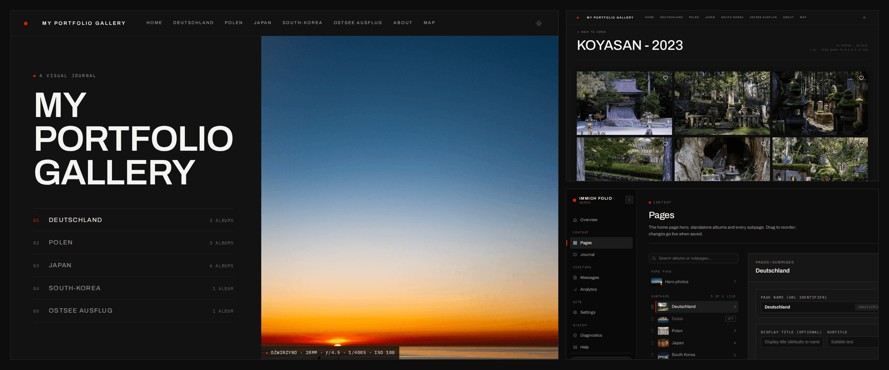
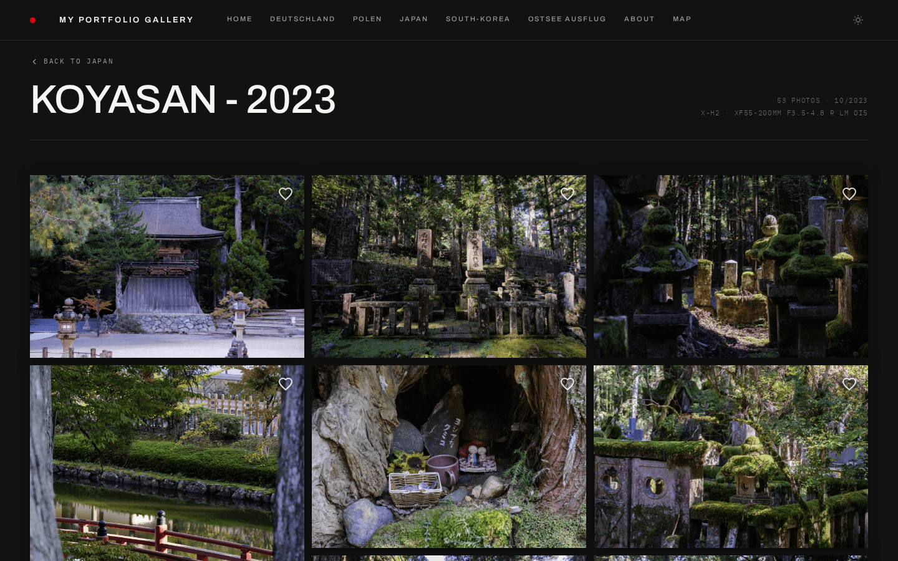
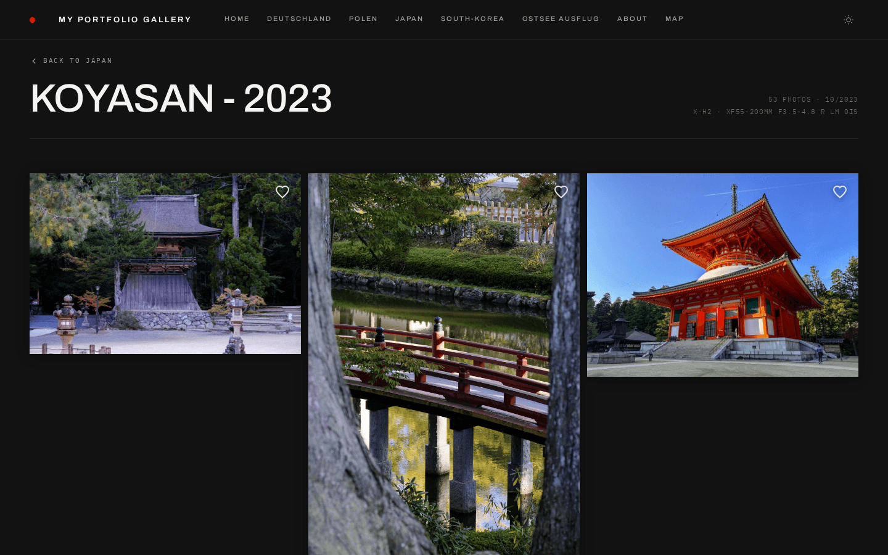

# Immich Folio

**Turn your Immich albums into a public photography portfolio — without ever exposing your Immich server to the internet.**

<p>
  <a href="LICENSE"></a>
  <a href="https://github.com/ralksta/immich-folio/releases"></a>
</p>

<p align="center">
  
</p>

A self-hosted portfolio powered by [Immich](https://immich.app). It acts as a **secure reverse proxy** between your visitors and your private Immich instance: your Immich server stays on your local network, completely invisible to the outside world, while your albums are published as a gallery you control.

**Latest: v0.20.1** — a single click zooms the lightbox in, and the setup guide now names the `asset.download` permission that zoom and downloads need. → [Release notes](https://github.com/ralksta/immich-folio/releases/latest)

## Features

- **Albums as pages** — group Immich albums into subpages, standalone albums and a hero, all defined in `content/gallery.yaml` or built in the admin panel
- **Grids and layouts** — masonry, uniform, showcase, filmstrip, editorial flow and justified rows, with six hero layouts and per-page overrides
- **Fullscreen lightbox** — keyboard and swipe navigation, EXIF panel, and opt-in zoom to full resolution ([guide](docs/gallery-features.md#photo-zoom))
- **Twelve theme presets** — each in dark and light, with fine control over colours, fonts and photo frames ([guide](docs/theming.md))
- **Journal and photo essays** — long-form stories with drafts, passwords and a map ([guide](docs/journal.md))
- **Client work** — password-protected pages, proofing with favourites, private proofing links and originals as a ZIP
- **Admin panel** — visual page builder, journal studio, settings editor, backups and diagnostics at `/admin` ([guide](docs/admin-panel.md))
- **Private by design** — your Immich URL and API key never reach the browser, asset IDs are encrypted into opaque tokens, and only the albums you list are reachable
- **Six interface languages**, cookieless analytics and dynamic social preview images

<p align="center">
  
  
</p>

→ **[All features, with screenshots](docs/features.md)**

## Quick start

You need an Immich server (3.0 or newer) and Node.js 20+, or just Docker. [Immich setup](docs/immich-setup.md) covers the API key and its permissions.

```bash
git clone https://github.com/ralksta/immich-folio.git
cd immich-folio
npm install
npm run dev
```

Open `http://localhost:3000/install` and let the setup wizard connect you to Immich. It needs a token from the server log, which is printed on first access ([First-run setup](docs/deployment.md#first-run-setup)).

<details>
<summary><strong>Prefer to configure by hand?</strong></summary>

The wizard writes the same files you would write yourself, so the manual route remains fully supported:

```bash
cp .env.local.example .env.local
# Edit .env.local with your Immich server URL and API key

cp content/gallery.yaml.example content/gallery.yaml
# Edit gallery.yaml with your album UUIDs

npm run dev
```

</details>

Something not coming up? `npm run doctor` checks the configuration from the terminal, with no running app and no admin password needed ([Config Doctor](docs/deployment.md#config-doctor)).

### Docker

```bash
docker compose up -d
```

The gallery is then at `http://localhost:7211`. The `content/` volume must be read-write. See [Deployment](docs/deployment.md) for the Compose file, health check, reverse proxy and CDN mode.

## Documentation

| Guide                                        | Covers                                                                     |
| -------------------------------------------- | -------------------------------------------------------------------------- |
| [Immich setup](docs/immich-setup.md)         | Version, API key permissions, full-size images                             |
| [Deployment](docs/deployment.md)             | First-run wizard, environment variables, Docker, reverse proxy, CDN        |
| [Gallery structure](docs/gallery-config.md)  | `gallery.yaml`: hero, albums, subpages, per-album options, content pages   |
| [Site settings](docs/site-settings.md)       | `settings.yaml`: grid, language, navigation, watermark, SEO, footer, about |
| [Gallery features](docs/gallery-features.md) | Passwords, proofing, photo zoom, original downloads                        |
| [Security](docs/security.md)                 | Rate limits, trusted proxies, token revocation                             |
| [Theming](docs/theming.md)                   | Presets, colours, fonts, hero styles                                       |
| [Journal & photo essays](docs/journal.md)    | File format, blocks, drafts, Journal Studio                                |
| [Admin panel](docs/admin-panel.md)           | Page builder, settings, analytics, backups                                 |
| [Features](docs/features.md)                 | The full feature list with screenshots                                     |

Release history is in the [CHANGELOG](CHANGELOG.md) and the [GitHub releases](https://github.com/ralksta/immich-folio/releases). Security fixes ship in normal releases, so running the latest release is the recommended baseline.

## Contributing

Built with Next.js 16, React 19, TypeScript and plain CSS. Maintained by [@ralksta](https://github.com/ralksta); see [CONTRIBUTORS.md](CONTRIBUTORS.md) for everyone who helped. Contributions are welcome: start with [CONTRIBUTING.md](CONTRIBUTING.md), and open pull requests against `dev`.

## License

MIT License. Free to use and modify for the Immich community.
