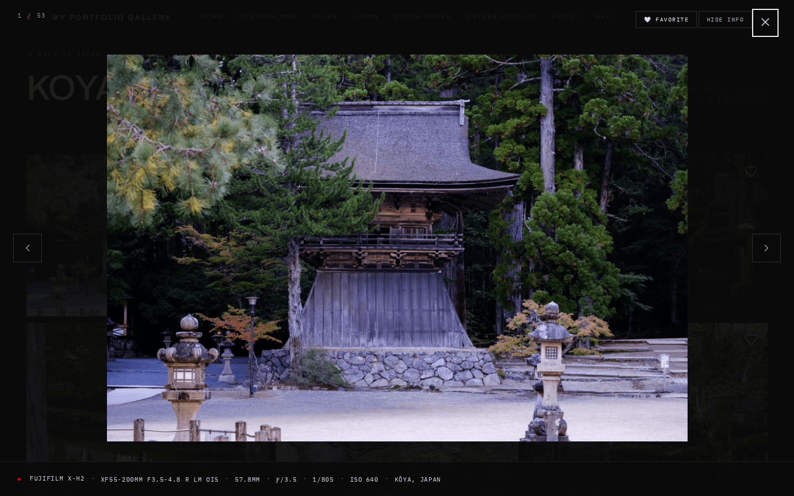
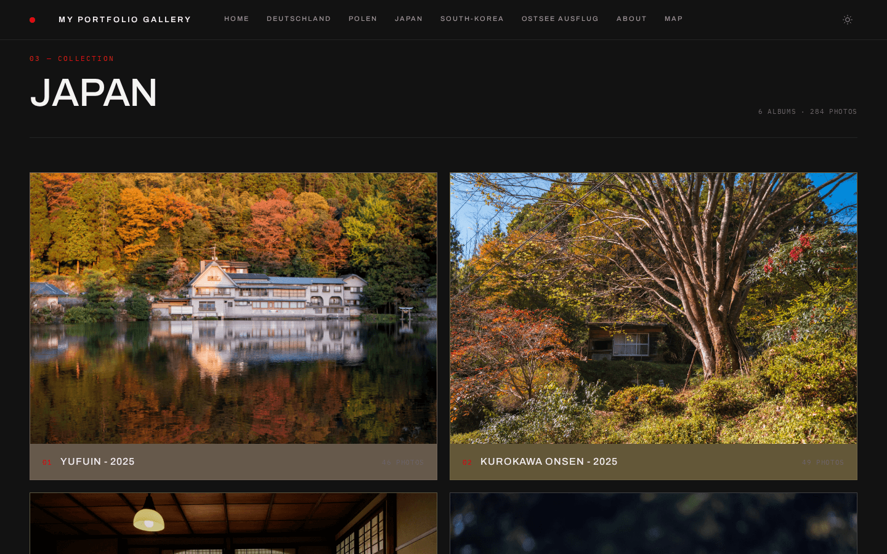
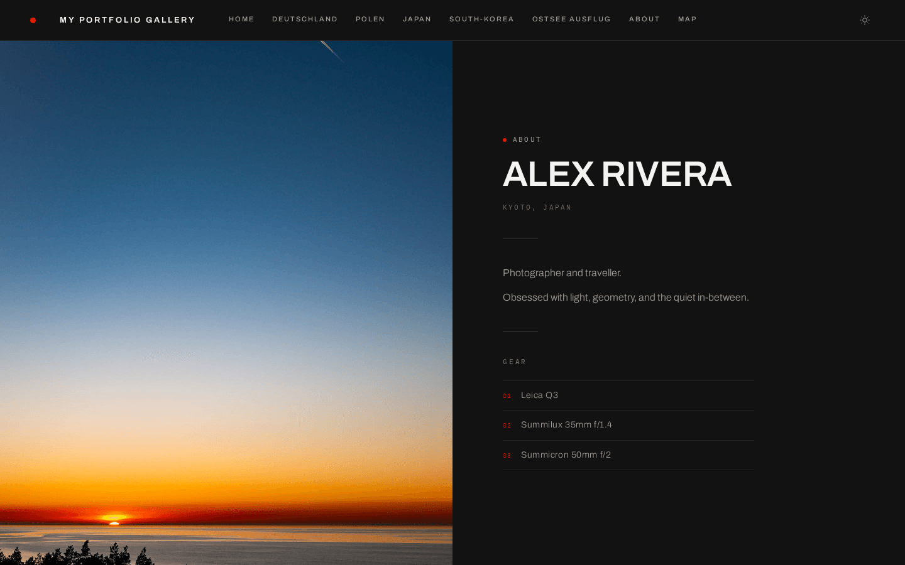
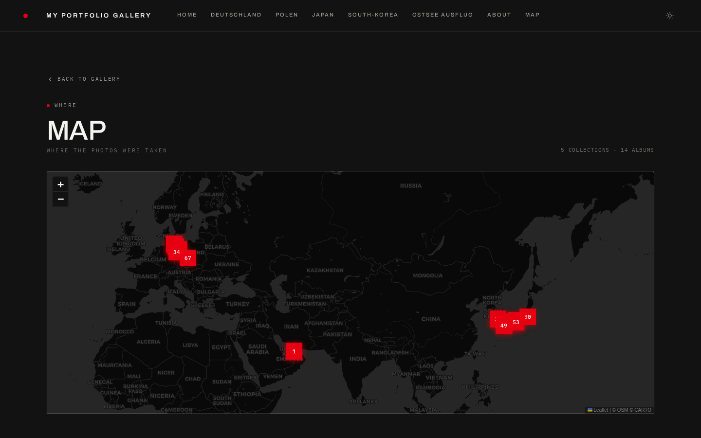

# Features

Everything Immich Folio does, grouped by what you are doing. The [README](../README.md) has the short version; each feature links to its guide where there is one.

## Gallery & Layout

- **Configurable hero layouts** — split, fullbleed, minimal, stacked (image + thumbnail strip), typographic (text-only), or mosaic (multi-image grid)
- **Hero image carousel** — single image or crossfade carousel of multiple Immich assets
- **Masonry photo grid** — responsive layout with natural aspect ratios and configurable columns, gap, and aspect ratio
- **Uniform grid mode** — switch to a fixed-aspect uniform grid per-subpage or globally
- **Showcase / filmstrip / editorial-flow layouts** — featured hero + grid, horizontal scroll strips, or alternating full-width and paired images
- **Justified rows** _(experimental)_ — every row fills the width at one shared height, aspect ratios intact, nothing cropped
- **Per-subpage grid overrides** — each subpage can define its own columns, gap, aspect ratio, and layout mode, and individual albums can override that again _(experimental)_
- **Cover focal points** _(experimental)_ — decide which part of a cover survives the crop
- **Fullscreen lightbox** — keyboard and swipe navigation, EXIF panel, adjacent image preloading, and opt-in 1:1 zoom to full resolution for checking sharpness ([guide](gallery-config.md#photo-zoom))
- **EXIF metadata on hover** — camera body, lens, focal length, aperture, shutter speed, ISO shown directly on the grid
- **ThumbHash placeholders** — instant blurred previews while full images load

  
  

<em>Masonry and showcase, both in Studio Modern — the same album, a different grid layout.</em>

  

<em>The fullscreen lightbox with the EXIF panel — camera, lens and exposure for the frame on screen.</em>

## Content & Organization

- **Subpage grouping** — organize albums into named collections (e.g. `/japan/tokyo-2023`)
- **Auto-generated slugs** — URL slugs derived from album names automatically
- **YAML gallery config** — all gallery structure defined in a single `content/gallery.yaml` file
- **Markdown about page** — `content/about.md` with frontmatter for portrait, name, location, and gear list, editable from the admin panel
- **Journal** — photo essays and travel stories at `/journal`, with drafts, per-entry passwords, cover images and reading times; new entries can start from a template (wedding, hiking, travel, …)
- **Photo Essay mode** — long-form storytelling pages alternating text with fullbleed, paired and grid image layouts, facts lists, a slice of an album, and a map with the pins you choose — typed places, or photos placed by their GPS
- **Unlisted subpages** _(experimental)_ — reachable by direct link, absent from the navigation
- **Subpage on/off toggle** — take a page offline without deleting it
- **External navigation links** _(experimental)_ — point the header at a shop, a blog, or a social profile
- **Client proofing** — clients favorite photos and export the selection; picks stay in the visitor's browser and the URL, with nothing stored server-side (proofing links, below, do save them)
- **Client proofing links** — a private link per client and album, picks saved server-side, a submit that locks the selection and pings you via webhook, expiry dates, download limits, and a Lightroom-ready export of the chosen file names ([guide](gallery-config.md#client-proofing-links))
- **Originals delivery** — per-album opt-in lets visitors download a whole album or their proofing selection as a ZIP of the originals, with GPS coordinates removed from JPEG, HEIC and AVIF files
- **Lightbox watermark** — configurable overlay on fullscreen images
- **Six interface languages** — English, German, French, Spanish, Italian and Dutch for everything visitors see
- **Privacy-friendly analytics** — cookieless view counts, no third parties, can be switched off
- **Dynamic OG images** — auto-generated social preview images per album

  

<em>A subpage grouping several albums into one collection.</em>

  
  

<em>The Markdown about page and the GPS map, both generated from your Immich data.</em>

## Admin Panel

- **Visual page builder** — drag & drop interface to manage hero images, standalone albums, subpages, and sections
- **Album picker** — browse all shared Immich albums with search, see photo counts, and add them with one click
- **Settings editor** — configure theme, grid layout, footer, legal/impressum, SEO, image protection and the about page from a visual UI
- **Visual previews everywhere** — grid layout, theme, photo frame, hero style and the Google search snippet are picked from preview cards instead of text fields
- **Journal Studio** — split-screen block editor with a live preview of the real page; start from a template, drag blocks into order
- **Essay block editor** — assemble photo essays block by block without touching Markdown
- **Unsaved edits survive** — leave the page builder or the journal editor mid-edit, and your changes are waiting when you come back
- **Diagnostics** — a page that checks the Immich connection, config and security settings, and links every finding to its fix
- **Photo order editor** — drag & drop a hand-picked opening sequence for any album
- **Favicon upload** — give the site its own icon in the browser tab
- **Backup manager** — every save is backed up automatically; restore any of them with one click
- **Live YAML sync** — changes are written directly to `gallery.yaml` and `settings.yaml` with automatic backups
- **Password protected** — secured with its own admin password, separate from album passwords

<strong>Security &amp; Infrastructure</strong>

 

| Concern                    | Protection                                                                           |
| -------------------------- | ------------------------------------------------------------------------------------ |
| **Server exposure**        | Immich URL never leaves your network — all requests proxy server-side                |
| **API key**                | Stored only in `.env.local`, never in client code                                    |
| **Asset IDs**              | Immich UUIDs encrypted (AES-256) into opaque tokens                                  |
| **Album scope**            | Only albums in `gallery.yaml` are accessible                                         |
| **Password protection**    | Per-subpage password support                                                         |
| **Rate limiting**          | Per-IP sliding-window rate limiter (configurable RPM)                                |
| **Vulnerability scanning** | Docker image scanned with Trivy on every release, results in the GitHub Security tab |

- Health check endpoint at `GET /api/health`
- In-memory caching with configurable TTL
- Optional CDN mode — photos and videos served through a pull CDN, so repeat views never reach your server ([Deployment Guide](deployment.md#cdn-mode))
- Standalone Docker image — multi-stage, non-root, ~150 MB
- Dependencies kept current via Dependabot (npm + GitHub Actions, weekly)

