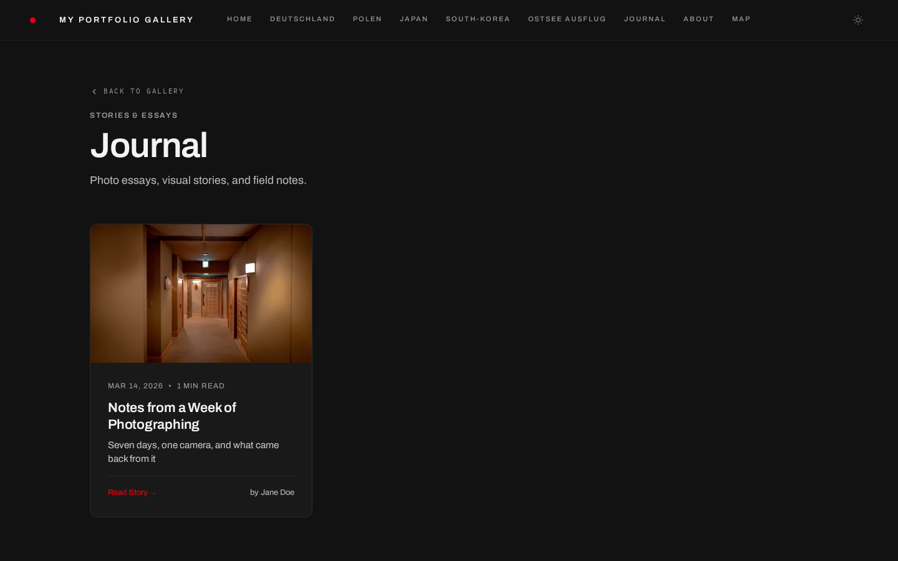
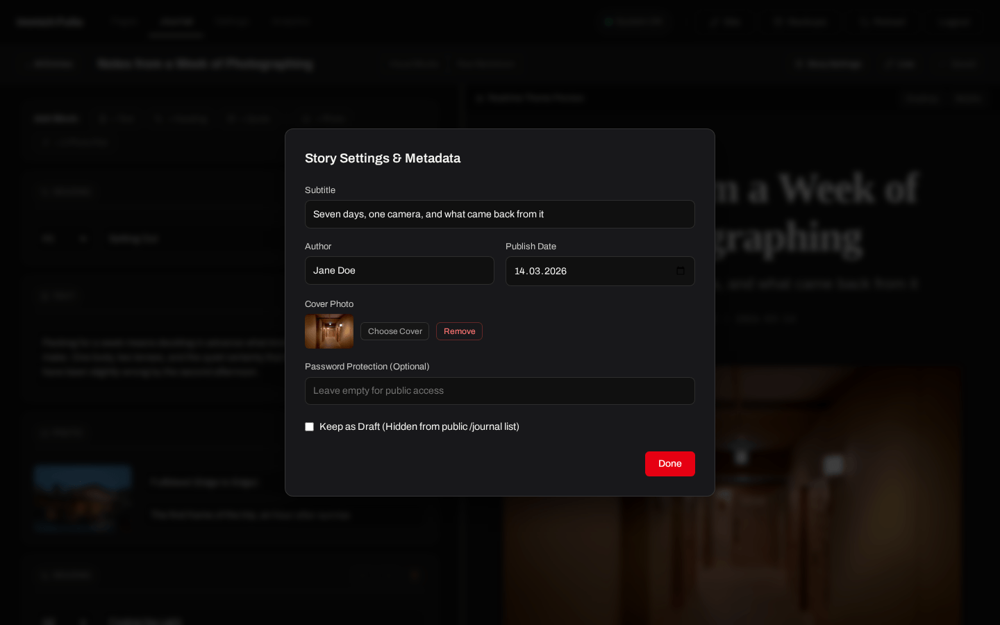
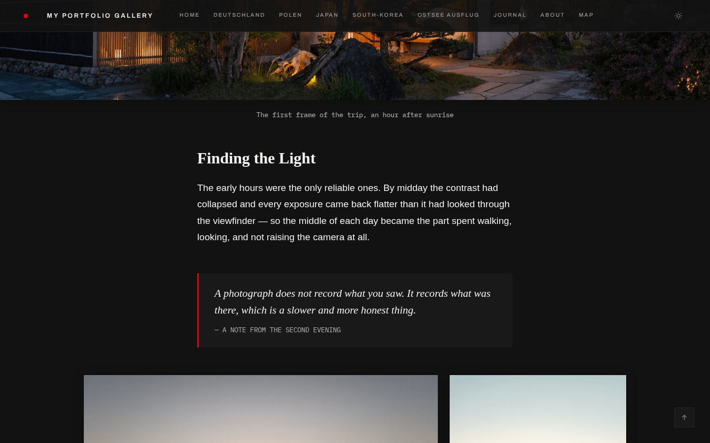
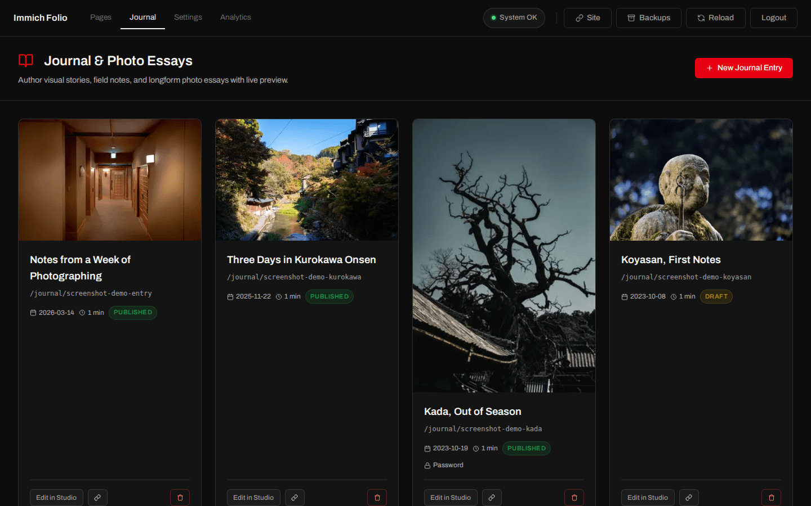
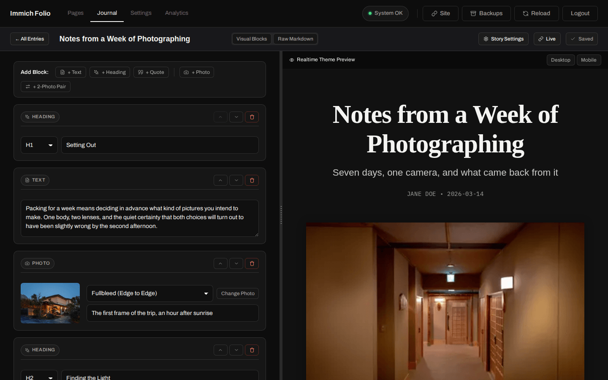

# Journal & Photo Essays

Immich Folio has two ways to publish long-form, text-and-image storytelling. They
share one Markdown format and one renderer, and differ only in where the result
appears:

| Feature         | Lives in               | URL               | Use for                                                          |
| --------------- | ---------------------- | ----------------- | ---------------------------------------------------------------- |
| **Journal**     | `content/journal/*.md` | `/journal/<slug>` | A running series of stories, listed on a `/journal` index page   |
| **Photo Essay** | `content/essays/*.md`  | the subpage's URL | Turning one subpage of your gallery into a single narrative page |

If you are unsure: use the **Journal**. A photo essay is the older mechanism and
is tied to a subpage; the journal is a standalone section with its own index,
cover images, reading times, and drafts.

**Contents:**

- [Journal Entries](#journal-entries)
- [Frontmatter](#frontmatter)
- [Block Syntax](#block-syntax)
- [Drafts](#drafts)
- [Password-protected Entries](#password-protected-entries)
- [Journal Studio](#journal-studio)
- [Photo Essays on a Subpage](#photo-essays-on-a-subpage)

## Journal Entries

Each entry is one Markdown file in `content/journal/`. The filename is the URL
slug — `content/journal/iceland-highlands.md` is served at
`/journal/iceland-highlands`.

A `/journal` link appears in the site navigation automatically as soon as at
least one **published** (non-draft) entry exists. There is no setting to turn
the journal on: an empty `content/journal/` directory means no journal.

<p align="center">
  
</p>
<p align="center"><em>The index at <code>/journal</code> — cover image, title, date and reading time per entry.</em></p>

A template ships with the project:

```bash
cp content/journal/sample-story.md.example content/journal/my-first-story.md
```

The template is an `.example` file on purpose — it references no asset IDs
(those are specific to your Immich server), so copying it gives you a working
skeleton rather than a page full of broken images.

## Frontmatter

Optional YAML block at the top of the file:

```markdown
---
title: 'The Icelandic Highlands'
subtitle: 'A visual journey across volcanic deserts and arctic silence'
author: 'Your Name'
date: '2026-08-05'
coverAssetId: 'asset-uuid-for-the-cover'
draft: false
password: 'clients-only'
---
```

| Field          | Description                                                                              |
| -------------- | ---------------------------------------------------------------------------------------- |
| `title`        | Entry heading and browser/OG title. Defaults to the slug.                                |
| `subtitle`     | Subline under the heading; also used as the meta description.                            |
| `author`       | Shown in the entry byline.                                                               |
| `date`         | Publication date shown on the index and the entry.                                       |
| `coverAssetId` | Immich asset UUID used as the index card image and the OG preview image.                 |
| `draft`        | `true` hides the entry from visitors — see [Drafts](#drafts).                            |
| `password`     | Gates this single entry — see [Password-protected Entries](#password-protected-entries). |

Reading time and the index excerpt are computed from the text; you do not
configure them.

Every one of these fields is also a form control in the
[Journal Studio](#journal-studio), behind **Story Settings**:

<p align="center">
  
</p>
<p align="center"><em>The same frontmatter, as a form — including the cover picker, the password field and the draft toggle.</em></p>

## Block Syntax

The parser is deliberately small. It understands headings, paragraphs, quotes
and photos — one block per blank-line-separated chunk.

### Headings

```markdown
# Into the Wilderness

## Landmannalaugar
```

`#` through `######` are supported.

### Text

Plain paragraphs. Inline `**bold**`, `*italic*` and `[links](https://example.com)`
work; links open in a new tab. Everything else is escaped rather than passed
through, so a paragraph can never inject HTML into the page.

### Quotes

```markdown
> Silence in the highlands is a physical weight. -- Anonymous
```

Text after a `--` separator becomes the attribution line.

### Photos

Photos are referenced by their **Immich asset UUID**, not by a file path:

```markdown


```

| Suffix       | Width                                         |
| ------------ | --------------------------------------------- |
| `:fullbleed` | Edge to edge, breaking out of the text column |
| `:wide`      | Wider than the text column, but still inset   |
| _(none)_     | Contained — same width as the text            |

Two UUIDs separated by a comma render as a side-by-side pair, sized to their
real aspect ratios rather than forced equal:

```markdown

```

Three or more render as a grid — rows of up to three, each row justified like
a pair (one shared height, widths from the real ratios, nothing cropped),
stacked on phones:

```markdown

```

Photos in an entry open in the same lightbox as the rest of the site, with
keyboard and swipe navigation.

### Facts

A `::facts` line followed by `Label: Value` lines in the same paragraph
renders as a compact definition list — distance and elevation for a hike,
date and venue for a wedding:

```markdown
::facts
Distance: 21 km
Elevation: 1,240 m
Start: 08:30
```

The first colon splits label from value, so a time keeps its `:`. Values take
the same inline markdown as text. Lines without a colon are ignored.

### Map

A `::map` line, with an optional caption after it, starts a map. The lines
after it say what is on it — numbered pins in the order written, joined by
a line:

```markdown
::map Busan → Seoul
Busan harbour: 35.098, 129.036
photo: 8f1c0e2a-…
photos: all
Seoul: 37.566, 126.978
line: off
```

| Line              | Puts on the map                                                                                   |
| ----------------- | ------------------------------------------------------------------------------------------------- |
| `Label: lat, lng` | A point with a label, exactly where you typed it.                                                 |
| `lat, lng`        | A point without a label.                                                                          |
| `photo: <uuid>`   | One of the entry's photos, placed by its GPS. Several ids may follow, comma-separated.            |
| `photos: all`     | Every geotagged photo in the entry, in the order they appear — skipping ids already listed above. |
| `line: off`       | No connecting line. The default draws one when there are two or more pins.                        |

A map with no lines renders nothing. `photo`, `photos` and `line` are reserved
as labels; a coordinate pair that does not parse, or lies outside ±90 / ±180,
is ignored (the Studio warns before you save).

Typed points are published as typed — they are your content. Photo pins are
derived from EXIF, so they follow each album's `location:` setting the way
the map page does: `hidden` and `country` add no pin, `city` snaps to the
same 5 km grid, and where an album allows exact positions a journal pin is
still snapped to a 1 km grid — the map page shows the mean of an album's
photos in a city, never a single photo, and a story map should not be the
first surface that places one photo at its doorstep. Photo pins are computed
when the page renders; the Studio's preview shows typed points right away and
leaves photo pins for the live page.

The block renders only while `map: true` is set in `settings.yaml`, typed
points included — that setting also means "no map tiles from CartoDB for my
visitors".

### Album

"The first twelve of the Seoul album", without picking each photo:

```markdown
::album 371336b4-eb59-409c-b24e-a613f81ede5a
count: 12
skip: 0
layout: grid
caption: Twelve from Seoul
```

| Line           | Meaning                                                                         |
| -------------- | ------------------------------------------------------------------------------- |
| `::album <id>` | The Immich album id — the Studio's album picker fills it in.                    |
| `count: N`     | How many photos. Default: the whole album.                                      |
| `skip: N`      | Offset, so two blocks can split one album. Default 0.                           |
| `layout: …`    | `grid` (rows of three, default), `pairs` (rows of two) or `wide` (one per row). |
| `caption: …`   | One caption under the set.                                                      |

The block is expanded into ordinary photo blocks when the page renders, so
the lightbox and everything else work as for hand-picked photos. Photos come
in the album's order; if the gallery pins a manual `assetOrder` for that
album, those come first. The album need not be published in `gallery.yaml` —
an entry may already show any single photo by id, and the author's pick is
the gate for a whole album just the same.

<p align="center">
  
</p>
<p align="center"><em>A rendered entry — headings, body text, a fullbleed photo and a pull quote, from the blocks above.</em></p>

> [!TIP]
> Writing asset UUIDs by hand is tedious. In the [Journal Studio](#journal-studio),
> **Add Block → Photo**, **2-Photo Pair** and **Photo Grid** open the asset
> picker and fill the UUIDs in for you; **Facts** and **Map** have their own
> small forms. New entries can also start from a template — Wedding, Hiking,
> Travel and the others — instead of an empty editor.

## Drafts

`draft: true` in the frontmatter keeps an entry out of the `/journal` index and
out of the navigation link check — but a logged-in admin still sees it, both in
the index and at its URL. That makes the draft a preview of the real page rather
than a separate preview mode.

Drafts are not secret: the entry stays reachable at its URL for anyone who knows
the slug. Use a `password` if it must not be readable.

## Password-protected Entries

A `password` in the frontmatter puts the entry behind the same gate used for
subpages and albums. The unlock cookie is `lb_auth_journal_<slug>` and expires
after 24 hours.

Store a hash rather than the plaintext where possible — the `scrypt:salt:hash`
format described in [Gallery Configuration](gallery-config.md) applies here too.
A plaintext password works but is logged as a warning at startup.

## Journal Studio

The admin panel's **Journal** tab lists every entry — drafts included, marked as
such — with its cover, date and password state:

<p align="center">
  
</p>
<p align="center"><em>Published and draft entries side by side; the lock marks an entry with a password.</em></p>

Opening one gives a split-screen editor: blocks on the left, a live preview of
the real page on the right, with a draggable divider between them (mouse,
keyboard, and touch).

<p align="center">
  
</p>
<p align="center"><em>The Journal Studio — every block on the left, the real page on the right.</em></p>

- **Add Block** — heading, text, quote, photo, or photo pair
- **Photo picker** — browse your Immich library and insert the asset UUID
- **Cover image, title, subtitle, author, date, draft, password** — the
  frontmatter fields, as form controls
- **Reorder and delete** blocks; each block carries a type chip so a long entry
  stays scannable
- **Save** writes `content/journal/<slug>.md` in exactly the format documented
  above, with a backup of the previous version in `content/journal/.backups/`

Everything the studio writes can be edited by hand afterwards, and vice versa —
the studio parses the same files.

> [!NOTE]
> Entries written before the current photo syntax may contain position-based
> photo references. The studio marks those blocks instead of silently
> misrendering them, so they can be repointed at an asset UUID.

## Photo Essays on a Subpage

A subpage can render a Markdown essay instead of an album grid. Point it at a
file, inline the text, or let it build itself from the albums:

```yaml
subpages:
  - name: Highlands
    title: 'Icelandic Highlands'
    subtitle: 'A Photo Essay'
    essayFile: 'sample-story' # content/journal/sample-story.md
    albums:
      - 'album-uuid-iceland-1'
```

| Key           | Description                                                                                       |
| ------------- | ------------------------------------------------------------------------------------------------- |
| `essayFile`   | A **slug**, not a path — resolved as `content/journal/<slug>.md`, then `content/essays/<slug>.md` |
| `essayText`   | The essay Markdown inline in `gallery.yaml` — what the admin block editor writes                  |
| `grid.layout` | `essay` — renders as an essay even without `essayFile` or `essayText`                             |

Any one of the three switches the page into essay mode; setting `essayFile` or
`essayText` implies it, so `grid.layout: essay` is only needed on its own.

> [!IMPORTANT]
> `essayFile` takes a bare slug — letters, digits, `-` and `_`. A path such as
> `content/essays/sample-story.md` is rejected (dots and slashes are not valid
> slug characters) and the page falls back to the generated essay below.

The Markdown format is identical to a journal entry, including the photo block
syntax. The admin panel has a visual block editor for `essayText` under the
subpage's settings.

The album list is used either way: it supplies the photos the lightbox pages
through. And with `grid.layout: essay` but no Markdown at all, the essay is
generated from those albums — one heading per album, followed by its photos,
using each photo's Immich description as the caption.
