# Theming

Control the visual identity of your gallery from `content/gallery.yaml`. Choose a built-in preset or customize individual properties — no CSS editing required.

## Quick Start

Add a single line to your `gallery.yaml`:

```yaml
theme: minimal
```

That's it. Your entire gallery switches to the minimal theme.

## Built-in Presets

| Preset            | Style                          | Accent       | Fonts                             | Hero        | Frame        | Grain |
| ----------------- | ------------------------------ | ------------ | --------------------------------- | ----------- | ------------ | ----- |
| **studio**        | Leica-inspired, editorial      | 🔴 `#e60012` | Playfair Display + DM Sans        | Split       | Passepartout | ✓     |
| **studio-modern** | Leica precision, grotesque     | 🔴 `#e60012` | Archivo + IBM Plex Mono           | Split       | None         | ✗     |
| **minimal**       | Swiss brutalist, high contrast | ⚫ `#000000` | Geist + IBM Plex Mono             | Fullbleed   | None         | ✗     |
| **editorial**     | Cinematic magazine, warm tones | 🟤 `#8B2500` | Bodoni Moda + Newsreader          | Split       | Shadow       | ✗     |
| **classic**       | Gilded gallery, warm luxury    | 🟡 `#c49a3c` | Cinzel + Crimson Pro              | Minimal     | Passepartout | ✗     |
| **noir**          | Darkroom analog, film noir     | 🟠 `#ff6b35` | Libre Baskerville + Source Sans 3 | Fullbleed   | Passepartout | ✓     |
| **monograph**     | Typographic, book-like         | ⬛ `#333333` | Instrument Serif + Inter          | Typographic | None         | ✗     |

Default is `studio` if no theme is specified.

### Theme Gallery

_From left to right, top to bottom: Studio, Studio Modern, Minimal, Editorial, Classic, Noir, Monograph_

<p align="center">
  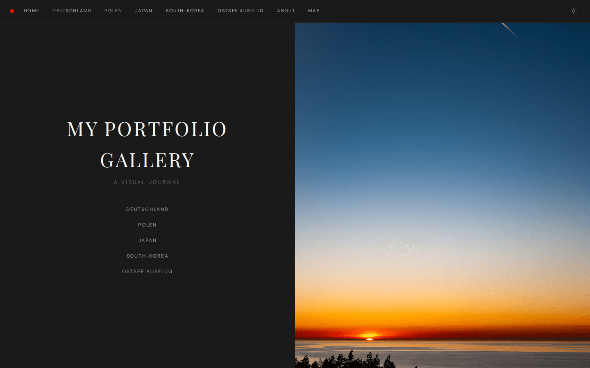
  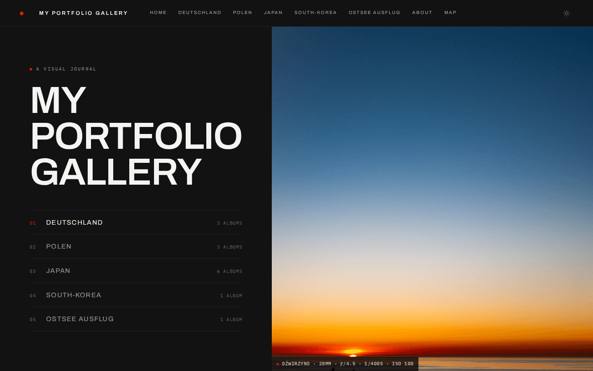
  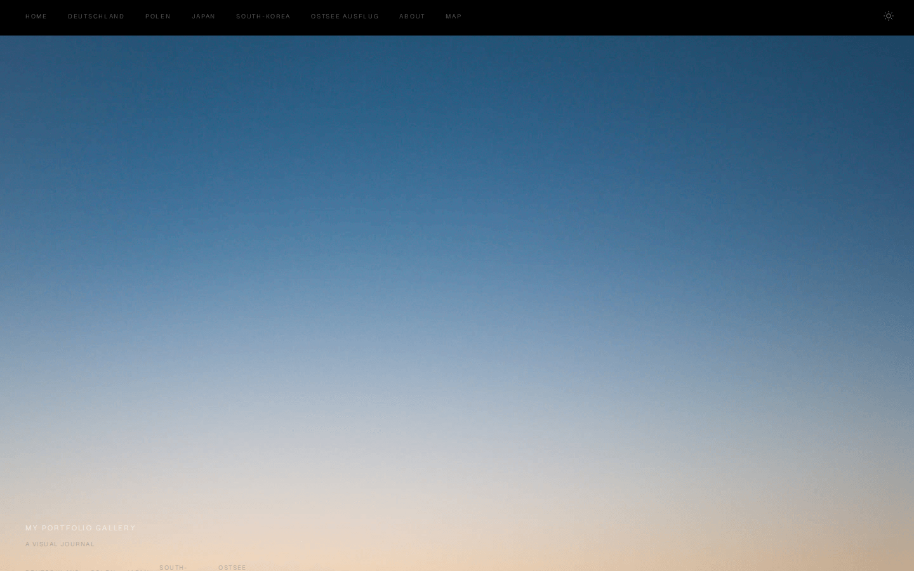
  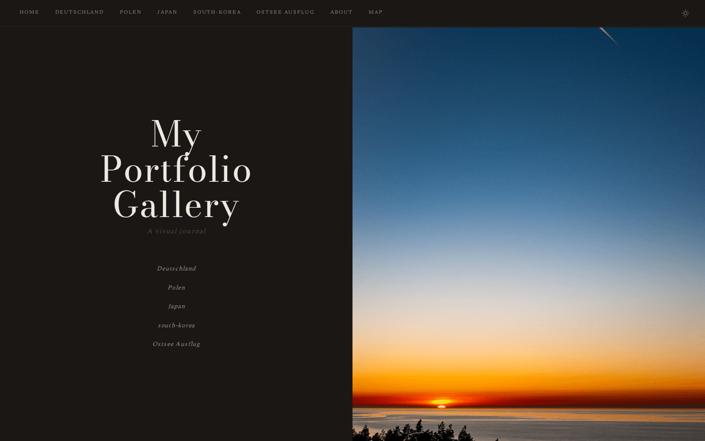
  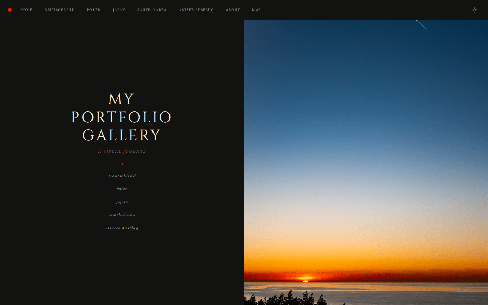
  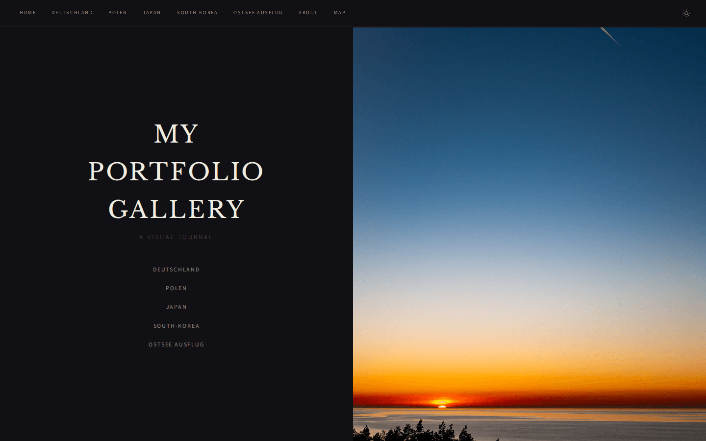
  
</p>

### Grid View Examples

_Same order as above._

<p align="center">
  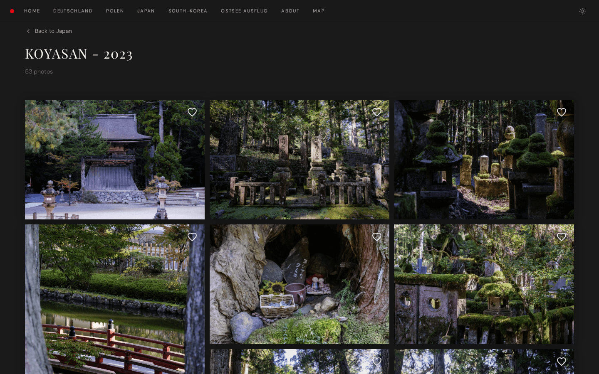
  
  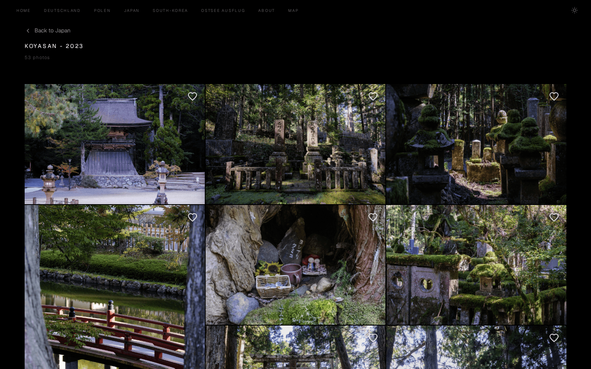
  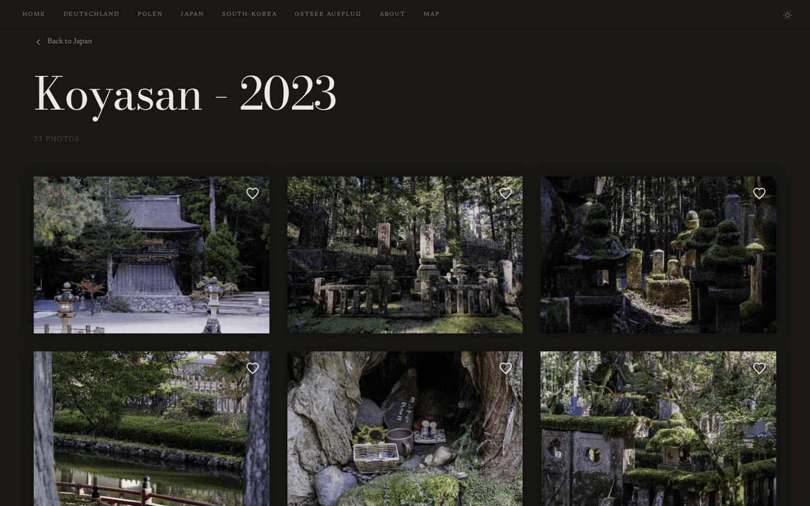
  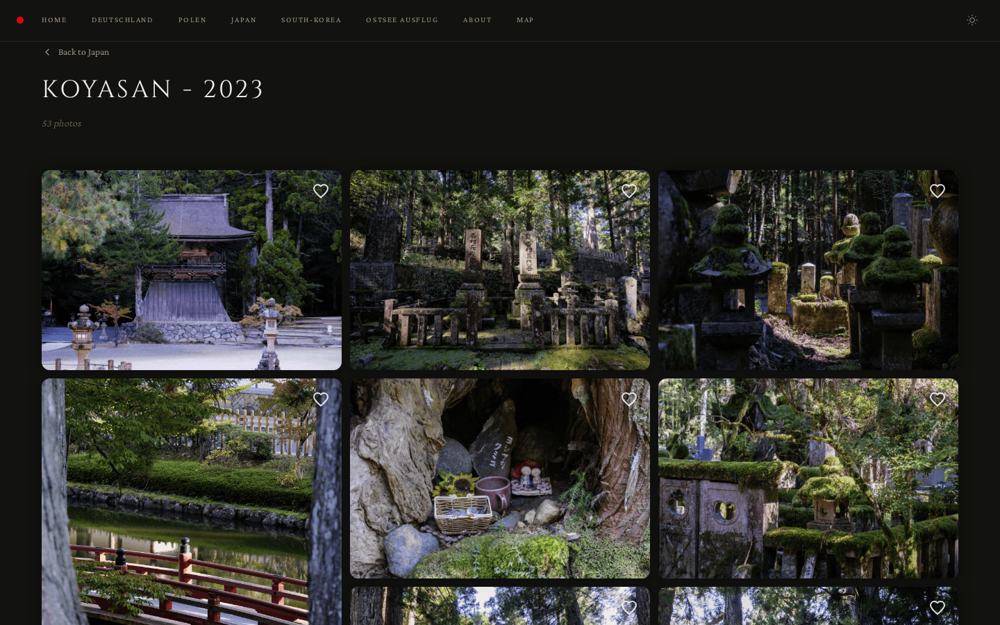
  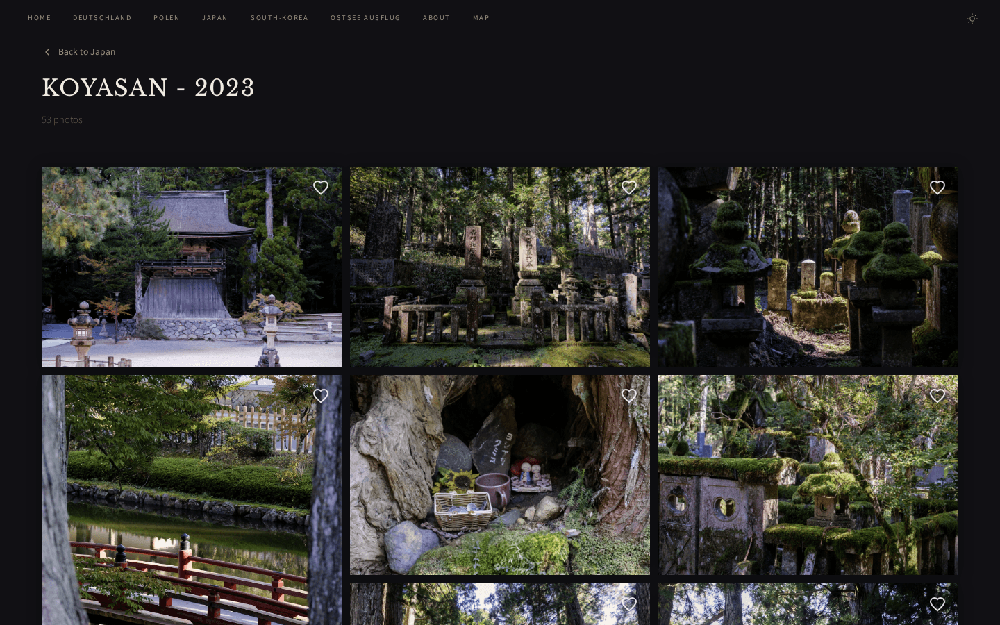
  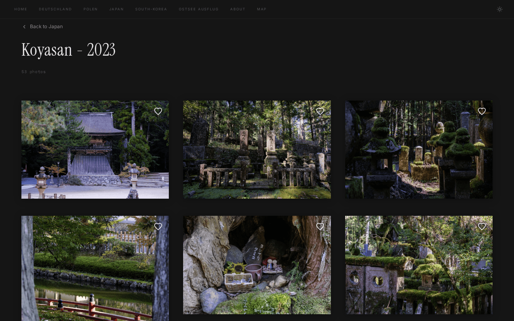
</p>

### Light Mode

Every preset ships with a light variant. Visitors switch with the toggle in the
navigation bar; the choice is remembered in `localStorage`, and the presets keep
their accent, fonts and framing in both modes.

<p align="center">
  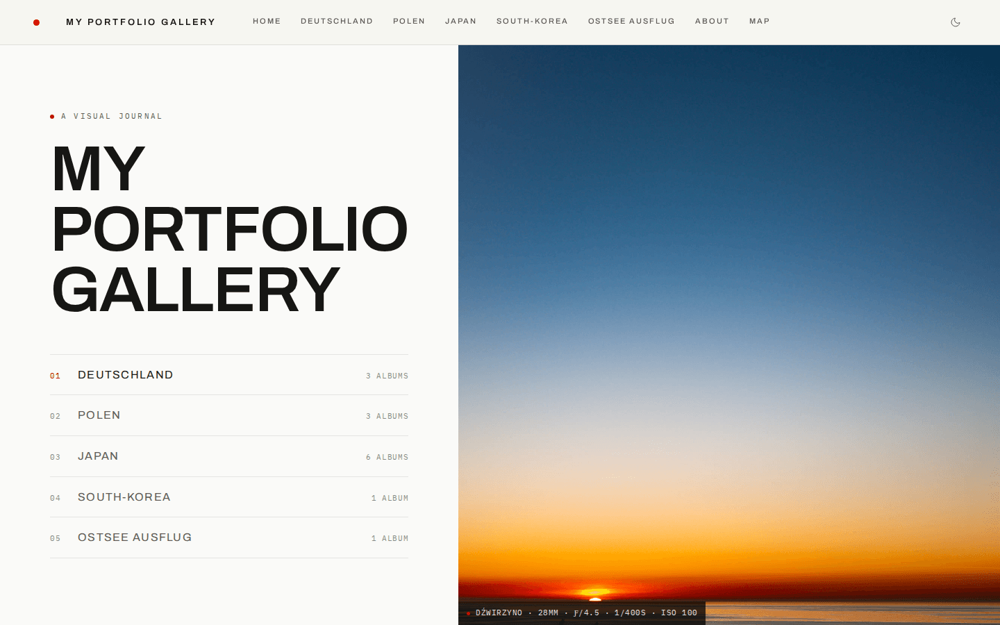
  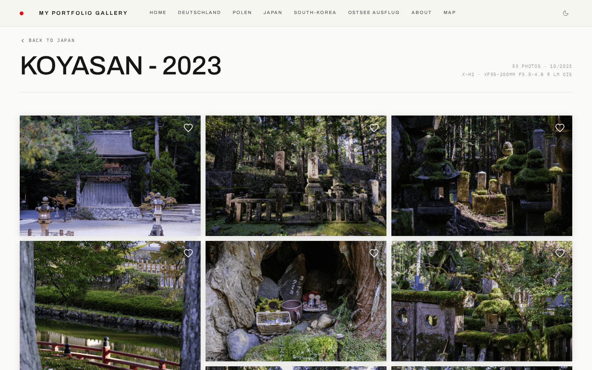
</p>

### What makes each theme unique

**Studio** (default) — Leica-inspired with a red nav dot, passepartout photo frames, film grain, and a split hero layout. Clean editorial feel with Playfair Display headings.

**Studio Modern** — The Leica language of `studio` rebuilt around the precision grotesque Archivo, with IBM Plex Mono for every piece of photographic metadata (EXIF chips, counters, indices). Hairline rules at 8% opacity, zero radius, an indexed hero nav with album counts, an always-visible caption bar under album covers, and a film-edge EXIF strip in the lightbox. Red is signal only — nav dot, active state, hover, indices, map markers.

**Minimal** — Swiss Brutalist aesthetic inspired by Müller-Brockmann and Dieter Rams. Fullbleed hero image, true black/white palette, zero-gap photo grid with no hover effects, ultra-tiny navigation text. Every pixel earns its place.

**Editorial** — Cinematic magazine feel inspired by Aperture and Magnum Photos. Oversized Bodoni Moda serif titles, warm charcoal backgrounds, generous grid spacing, slow cinematic transitions with desaturation-on-idle photos, and pull-quote section labels.

**Classic** — Fine art gallery aesthetic with warm gold accents, Cinzel Roman capitals for headings, decorative ornamental dividers, warm passepartout frames, rounded corners, and an elegant gold header dot. Feels like a luxury exhibition catalog.

**Noir** — Darkroom analog aesthetic with warm amber accents on a deep cool-black base. Sepia-tinted photos with vignette hover effects, film-edge EXIF labels in monospace, and a grain overlay. Inspired by wet-plate photography and film noir cinematography.

**Monograph** — Type-first book design with no hero image. Features an 8rem serif title, numbered photo indices via CSS counters, slide-up EXIF captions, hairline dividers, and generous whitespace. Feels like an artist monograph.

## Custom Theme

Start from any preset and override individual properties:

```yaml
theme:
  preset: studio # base preset to extend (default: studio)
  accent: '#2563eb' # brand/accent color (any hex)
  fonts:
    heading: 'Inter' # Google Fonts name for headings
    body: 'Inter' # body text
    caption: 'JetBrains Mono' # EXIF captions
  radius: 8 # border-radius in px (0 = sharp corners)
  photoFrame: none # "none" | "passepartout" | "shadow"
  grain: false # film grain overlay on photos
  headerDot: false # accent-colored dot in the nav bar
  heroStyle: split # "split" | "fullbleed" | "minimal" | "stacked" | "typographic" | "mosaic" | "cover"
```

All properties are optional — omitted values fall back to the preset defaults.

## Properties Reference

### `accent`

The brand color used for hover effects, navigation highlights, the header dot, and OG social preview images.

### `fonts`

Google Fonts names. Fonts are loaded automatically — just use the name as it appears on [fonts.google.com](https://fonts.google.com). Three font slots:

- **heading** — album titles, hero title, section labels
- **body** — navigation, descriptions, UI text
- **caption** — EXIF metadata, photo captions

### `radius`

Border radius in pixels applied to photo grid items and album cards:

- `0` — sharp, editorial corners
- `4-8` — subtle rounding
- `12+` — soft, modern feel

### `photoFrame`

How photos are framed in the grid:

- **`none`** — photos fill the grid cell directly
- **`passepartout`** — museum-style mat border around each photo with print-style EXIF captions below
- **`shadow`** — subtle drop shadow behind each photo

### `grain`

When `true`, a subtle film grain texture overlays each photo in the grid. Adds an analog, filmic character.

### `headerDot`

When `true`, shows a small accent-colored dot in the navigation bar (inspired by the Leica red dot).

### `heroStyle`

Controls the homepage hero layout:

- **`split`** — title/nav on the left, hero image on the right (used by Studio, Editorial)
- **`fullbleed`** — hero image fills the entire viewport, title overlaid in the corner (used by Minimal, Noir)
- **`minimal`** — centered title card with decorative ornament, hero image as a banner below (used by Classic)
- **`stacked`** — full-viewport hero image with title gradient-overlaid at the bottom, horizontal thumbnail navigation strip below
- **`typographic`** — no hero image; massive centered title with numbered album navigation list (used by Monograph)
- **`mosaic`** — asymmetric multi-image grid with frosted-glass title overlay centered on top
- **`cover`** _(experimental)_ — a splash screen: one fullscreen image, the site title and subtitle, and a single **Enter** link into the first navigation entry. The rest of the homepage is not rendered — visitors arrive at a title page and click through.

<table>
  <tr>
    <td align="center"><strong>Split</strong></td>
    <td align="center"><strong>Fullbleed</strong></td>
    <td align="center"><strong>Minimal</strong></td>
  </tr>
  <tr>
    <td></td>
    <td>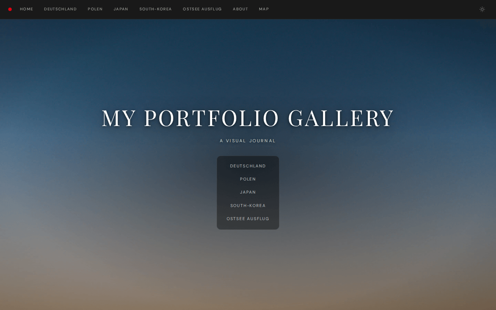</td>
    <td>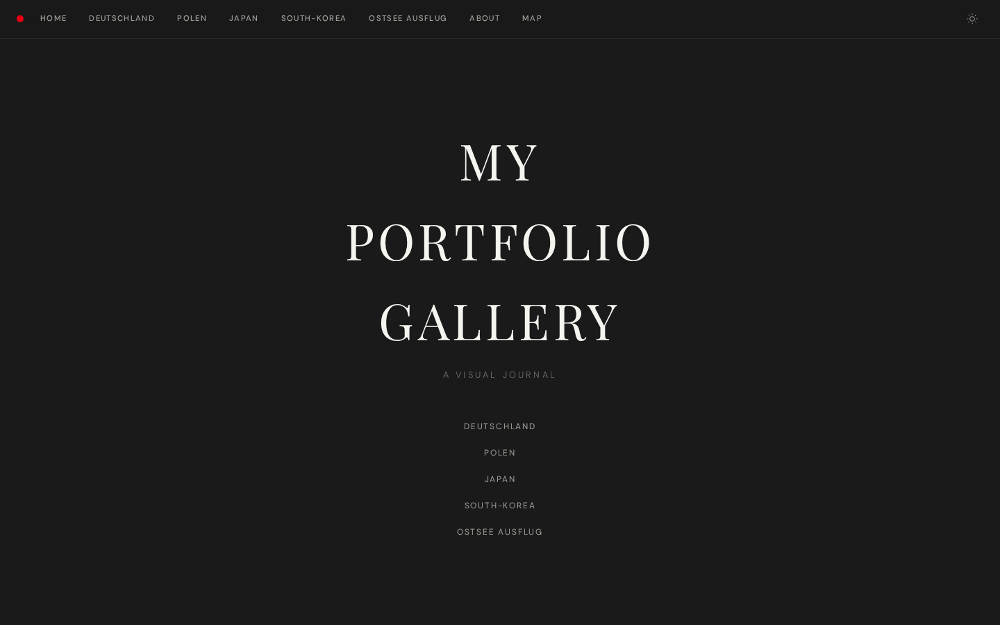</td>
  </tr>
  <tr>
    <td align="center"><strong>Stacked</strong></td>
    <td align="center"><strong>Typographic</strong></td>
    <td align="center"><strong>Mosaic</strong></td>
  </tr>
  <tr>
    <td>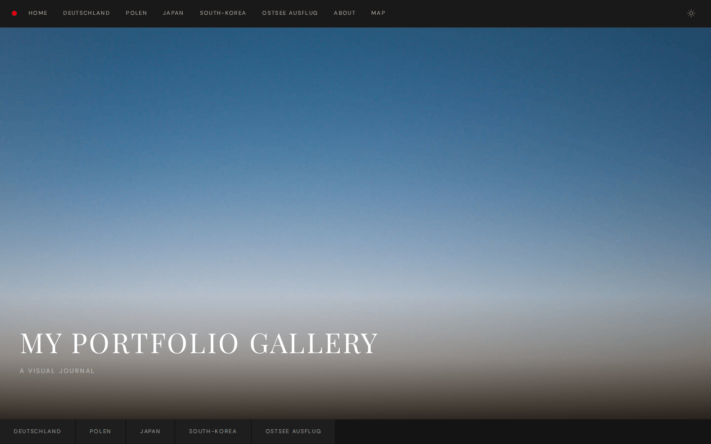</td>
    <td>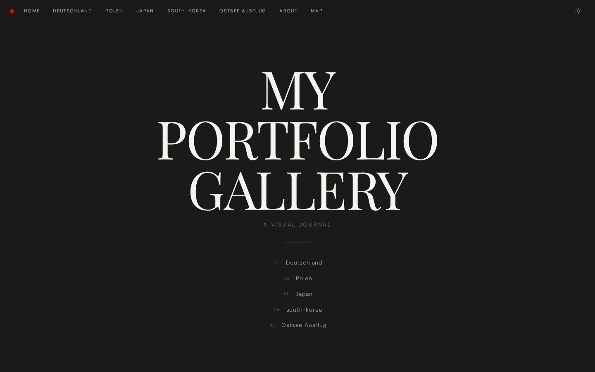</td>
    <td>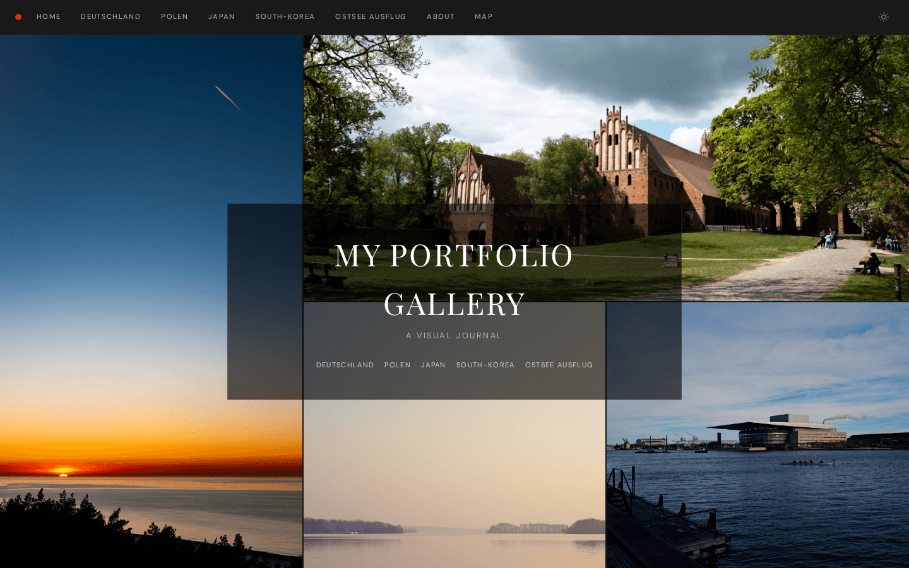</td>
  </tr>
</table>

### `grid.layout`

Controls the photo grid layout on album pages:

- **`masonry`** — Pinterest-style stacked columns, images shown at natural aspect ratios (default)
- **`uniform`** — CSS Grid with fixed aspect ratio cells
- **`showcase`** — first image displayed at full width (16:9), rest in standard grid
- **`filmstrip`** — horizontal scroll of tall vertical image strips with scroll snapping
- **`editorial-flow`** — alternating full-width (21:9) and side-by-side (4:3) image pairs
- **`justified`** _(experimental)_ — row-based: every row fills the container width and all images in a row share one height, so aspect ratios stay intact and nothing is cropped. `columns` sets the density — more columns give shorter rows. The last row keeps its natural sizes rather than stretching.
- **`essay`** — not a grid: renders the page as a photo essay. See **[Journal & Photo Essays](journal.md)**.

Set it globally in `settings.yaml`, per subpage in `gallery.yaml`, or on a
single album (experimental) — the three merge, most specific winning:

```yaml
grid:
  layout: showcase
```

The same album in five of the grid layouts (theme `studio-modern`):

<table>
  <tr>
    <td align="center"><strong>Masonry</strong> (default)</td>
    <td align="center"><strong>Uniform</strong></td>
  </tr>
  <tr>
    <td>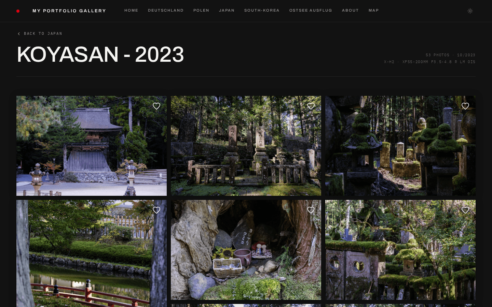</td>
    <td>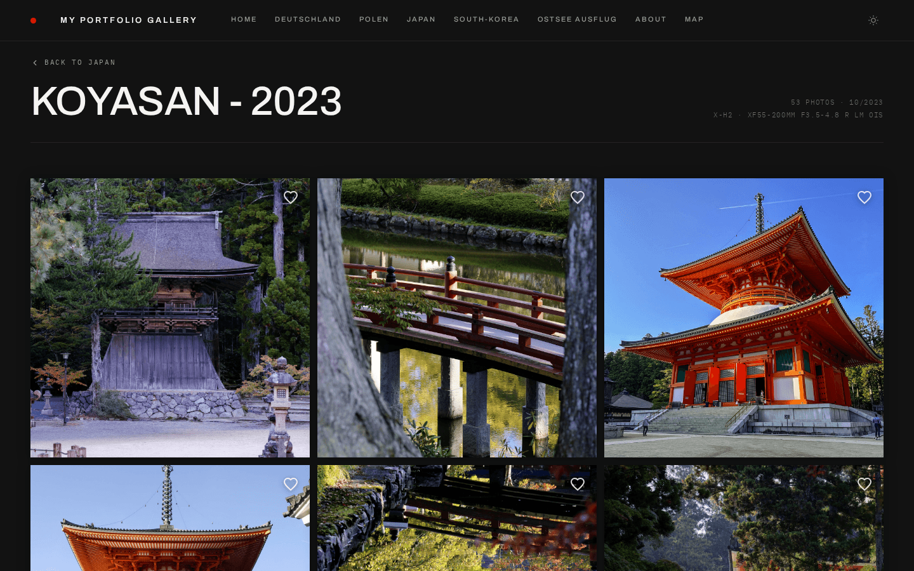</td>
  </tr>
  <tr>
    <td align="center"><strong>Showcase</strong></td>
    <td align="center"><strong>Filmstrip</strong></td>
  </tr>
  <tr>
    <td>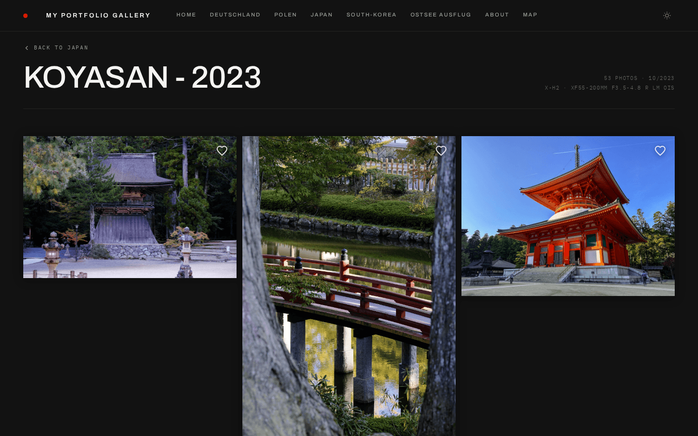</td>
    <td>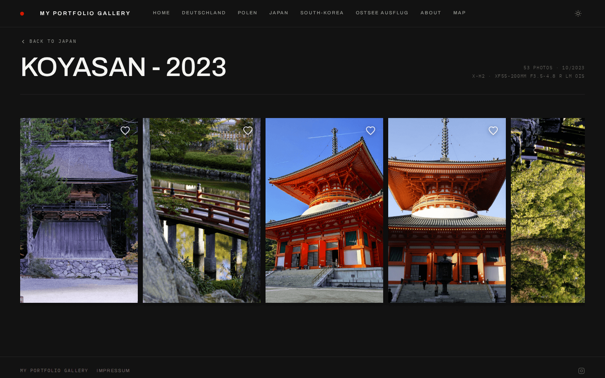</td>
  </tr>
  <tr>
    <td align="center" colspan="2"><strong>Editorial Flow</strong></td>
  </tr>
  <tr>
    <td colspan="2" align="center">
      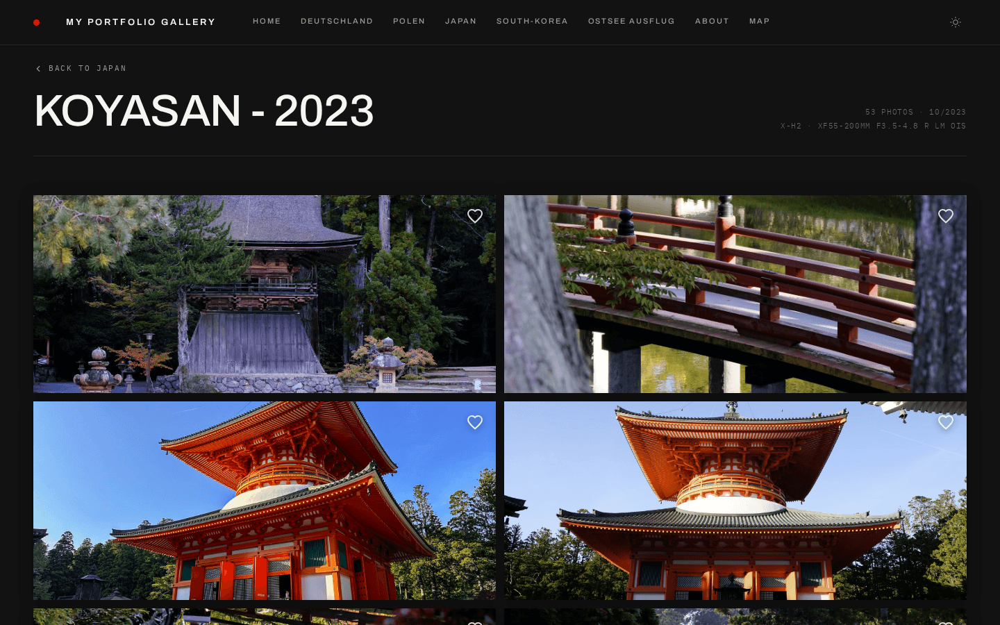
    </td>
  </tr>
</table>

## Examples

### Minimal portfolio

```yaml
theme:
  preset: minimal
  accent: '#0066cc'
  fonts:
    heading: 'Outfit'
    body: 'Outfit'
```

### Film photography blog

```yaml
theme:
  preset: studio
  accent: '#d4a017'
  grain: true
  photoFrame: passepartout
```

### Modern magazine

```yaml
theme:
  preset: editorial
  radius: 12
  fonts:
    heading: 'Fraunces'
    body: 'Inter'
    caption: 'IBM Plex Mono'
```

### Luxury gallery

```yaml
theme:
  preset: classic
  accent: '#b8860b'
  fonts:
    heading: 'Playfair Display'
    body: 'Lora'
```

### Dark analog portfolio

```yaml
theme:
  preset: noir
  heroStyle: stacked
```

### Type-forward monograph

```yaml
theme:
  preset: monograph
  accent: '#444'
  fonts:
    heading: 'DM Serif Text'
```

### Nature / travel journal

```yaml
theme:
  preset: editorial
  heroStyle: mosaic
grid:
  layout: editorial-flow
```

## Upgrading & rolling back

Adding a preset never requires a migration. Presets are additive, the
`gallery.yaml` / `settings.yaml` schema is unchanged, and existing presets keep
rendering exactly as before — pull the new version and restart.

The one case that needs attention is a **rollback after switching presets**. The
selected preset is stored in `content/settings.yaml`, so if you pick a preset
that was added later and then downgrade to a version that predates it, config
loading fails:

```
Unknown theme preset "studio-modern". Valid presets: studio, minimal, editorial, classic, noir, monograph
```

The message lists the presets the running version accepts. Set `theme.preset` to
one of them:

```yaml
theme:
  preset: studio # any preset the older version knows
```

`/admin` stays reachable when this happens, so you can also fix it from the
settings editor after the downgrade rather than beforehand.

The same error appears if you typo a preset name or copy an example for a preset
that does not exist — it is not specific to downgrades.
